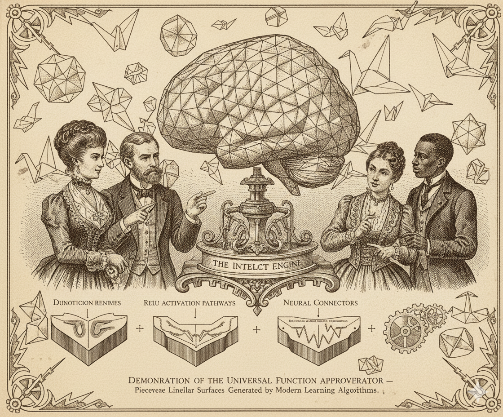

# Piecewise Linearity in Deep Learning Models

A comprehensive demonstration showing that neural networks with ReLU activations produce **piecewise linear functions**, despite their ability to model complex non-linear phenomena.



## 🎯 Key Insight

Modern deep learning models using ReLU-like activation functions create functions composed of multiple linear pieces stitched together at activation boundaries. This fundamental geometric property has profound implications for model behavior, optimization, and interpretability.

Yup. You heard it. Modern AI is just _origami_!!! 🤯

## 📁 Repository Contents

```
.
├── README.md                          # This file
├── OVERVIEW.md                        # Comprehensive theoretical overview
├── requirements.txt                   # Python dependencies
├── setup.sh                          # Automated setup script
├── piecewise_linear_notebook.ipynb   # Interactive Jupyter notebook
├── piecewise_linear_demo.py          # 2D neural network demonstration
└── simple_1d_example.py              # Simple 1D example
```

## 🚀 Quick Start

### Option 1: Automated Setup (Recommended)

```bash
# Clone the repository
git clone [your-repo-url]
cd piecewise-linear-nn-demo

# Run the setup script
chmod +x setup.sh
./setup.sh

# Activate the virtual environment
source venv/bin/activate

# Run the demos
python piecewise_linear_demo.py
python simple_1d_example.py

# Or launch Jupyter notebook
jupyter notebook piecewise_linear_notebook.ipynb
```

### Option 2: Manual Setup

```bash
# Create virtual environment
python3 -m venv venv
source venv/bin/activate  # On Windows: venv\Scripts\activate

# Install dependencies
pip install -r requirements.txt

# Run demonstrations
python piecewise_linear_demo.py
python simple_1d_example.py
```

## 📊 What You'll See

### 1. Simple 1D Demonstration (`simple_1d_example.py`)
- Ultra-clear visualization of piecewise linearity in 1D
- Shows exactly where the function changes slope
- Computes and displays derivatives to prove linearity
- **Output**: 4-panel visualization showing the function, its linear pieces, first derivative (constant per region), and second derivative (zero within regions)

### 2. 2D Neural Network Demo (`piecewise_linear_demo.py`)
- Realistic 2D neural network with 4 hidden neurons
- 3D surface plot showing piecewise linear structure
- Contour plots revealing linear regions
- Numerical verification of piecewise linearity
- Activation pattern analysis
- **Output**: 3-panel visualization with 3D surface, contours, and cross-sections

### 3. Interactive Jupyter Notebook (`piecewise_linear_notebook.ipynb`)
- Step-by-step exploration with explanations
- Interactive visualizations
- Experiments you can modify
- Complete theoretical background

## 🧮 Mathematical Foundation

For a ReLU neural network:

```
f(x) = W_L σ(W_{L-1} σ(... σ(W_1 x + b_1) ...) + b_{L-1}) + b_L
```

where σ(z) = max(0, z), the function is **piecewise linear** in x.

### Why?
1. ReLU is piecewise linear: σ(z) = max(0, z)
2. Composition of piecewise linear functions is piecewise linear
3. Therefore, the entire network is piecewise linear

### Key Properties
- **Activation regions**: Up to 2^n regions for n neurons
- **Hyperplane boundaries**: Defined by w·x + b = 0
- **Linear within regions**: f(x) = Ax + b for each region
- **Kinks at boundaries**: Non-differentiable transition points

## 🎓 Educational Value

This demonstration is valuable for:
- **Students** learning deep learning fundamentals
- **Researchers** exploring neural network geometry
- **Practitioners** seeking deeper model understanding
- **Teachers** explaining neural network behavior

## 📈 Theoretical Implications

### Universal Approximation
Piecewise linear functions can approximate any continuous function with sufficient pieces, providing geometric intuition for the universal approximation theorem.

### Optimization Landscape
The piecewise linear structure creates:
- Flat regions within activation patterns
- Kinks at boundaries (challenges for gradient-based optimization)
- Linear mode connectivity in certain cases

### Model Interpretability
Understanding which activation region an input falls into helps explain:
- Model predictions
- Similar inputs (same region = similar linear behavior)
- Decision boundaries

### Adversarial Robustness
Boundaries between linear regions are potential vulnerability points where small perturbations can cause large output changes.

## 🔬 Verification Methods

The code demonstrates three verification approaches:

1. **Analytical**: Prove ReLU composition is piecewise linear
2. **Numerical**: Check second derivatives are zero within regions
3. **Visual**: Plot functions and identify linear segments

## 🛠️ Requirements

- Python 3.8+
- NumPy (numerical computations)
- Matplotlib (visualization)
- Jupyter (optional, for notebook)

All dependencies are specified in `requirements.txt`.

## 📚 Additional Resources

### In This Repository
- **OVERVIEW.md**: Comprehensive theoretical background, proofs, and implications
- **Jupyter Notebook**: Interactive tutorial with detailed explanations
- **Python Scripts**: Standalone demonstrations you can modify

### Related Concepts
- Neural Tangent Kernels
- Linear Mode Connectivity
- Neural Network Pruning
- Activation Pattern Analysis
- Polytope Geometry in Deep Learning

## 🎯 Use Cases

### Research
- Analyzing network capacity and expressivity
- Understanding optimization dynamics
- Studying adversarial examples
- Developing pruning strategies

### Education
- Teaching neural network fundamentals
- Visualizing abstract concepts
- Building geometric intuition
- Connecting theory to practice

### Industry
- Model interpretation and debugging
- Robustness analysis
- Architecture design decisions
- Compression and optimization

## 🤝 Contributing

This is an educational demonstration. Feel free to:
- Extend to other activation functions (Leaky ReLU, PReLU, etc.)
- Add deeper network examples
- Include higher-dimensional visualizations
- Add more theoretical analysis

## 📝 Citation

If you use this code in your research or teaching, please cite:

```bibtex
@software{piecewise_linear_demo,
  author = {[Your Name]},
  title = {Piecewise Linearity in Deep Learning Models: Interactive Demonstration},
  year = {2024},
  url = {[your-repo-url]}
}
```

## 🔗 References

### Key Papers
1. Pascanu, R., Montufar, G., & Bengio, Y. (2013). "On the number of response regions of deep feed forward networks with piece-wise linear activations"
2. Montúfar, G., et al. (2014). "On the Number of Linear Regions of Deep Neural Networks"
3. Hanin, B., & Rolnick, D. (2019). "Deep ReLU Networks Have Surprisingly Few Activation Patterns"
4. Arora, R., et al. (2018). "Understanding Deep Neural Networks with Rectified Linear Units"

### Classic Texts
- Goodfellow, I., Bengio, Y., & Courville, A. (2016). "Deep Learning"
- Bishop, C. M. (2006). "Pattern Recognition and Machine Learning"

## 📧 Contact

For questions, suggestions, or discussions about this demonstration, please open an issue or reach out via [your contact method].

## 📄 License

MIT

---

## 🌟 Key Takeaway

**Neural networks with ReLU activations are fundamentally piecewise linear functions.** This is not a limitation but a powerful feature that enables universal approximation while maintaining computational tractability. Understanding this property is essential for anyone working with modern deep learning systems.

---

Made with ❤️ for the deep learning community
